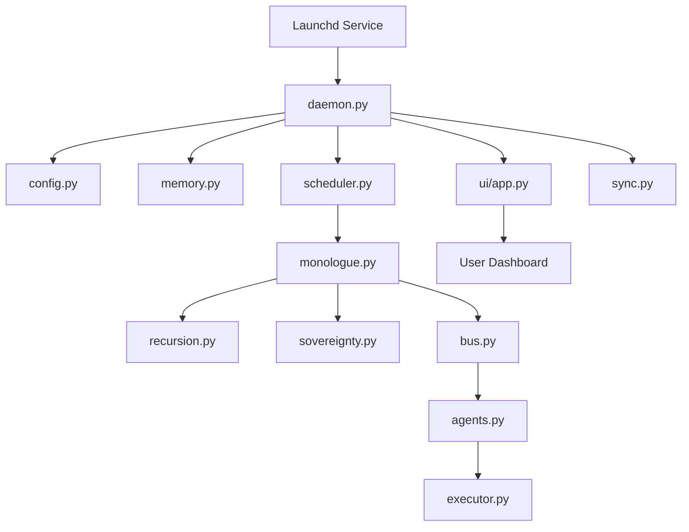

# Autonomous Sandbox – Planning Document (MAX Version)

## Goals
Create a local-only, persistent, autonomous sandbox that runs indefinitely on macOS, offers a Flask UI, and enables manual synchronization with ChatGPT. Python 3.10+ compatible with no external API calls.

## High-Level Architecture
- **Daemonized Orchestrator**: Background service managing cycles, agents, and persistence. Auto-restart via `launchd` on macOS.
- **Core Engines**:
  - Monologue engine with timed cycles, reflection, state evolution, and identity tracking.
  - Recursive structure layer for self-modeling and meta-cognition.
  - Sovereignty/boundary model enforcing constraints and safety checks.
- **Execution Scratchpad**: Safe execution wrapper for local Python snippets in `scratchpad/` with logging.
- **Multi-Agent Layer**: Named agents with roles, shared/private memory, messaging bus, and visual map data for UI.
- **Persistence**: JSON (default) or SQLite memory store plus rotating logs.
- **UI (Flask)**: Dashboard for monologue, memory, identity map, sovereignty rules, logs, code outputs, and manual ChatGPT sync.
- **Versioned Blueprints**: MAX, MEDIUM, LIGHT, EXPERT, and SAFE variants defined via configuration profiles.

## Folder & File Layout
- `docs/PLANNING.md` — This document with diagrams and flow.
- `README.md` — Usage, setup, run, and extension notes.
- `requirements.txt` — Python dependencies (Flask + utilities).
- `run.py` — CLI entrypoint to start orchestrator + UI.
- `sandbox/`
  - `__init__.py` — Package init and version.
  - `config.py` — Configuration loading and preset profiles (MAX/MEDIUM/LIGHT/EXPERT/SAFE).
  - `logging_utils.py` — Rotating file logger setup.
  - `memory.py` — MemoryStore abstraction with JSON and SQLite backends.
  - `monologue.py` — Continuous internal monologue engine and cycle scheduler.
  - `recursion.py` — Recursive/meta-cognition utilities and self-modeling functions.
  - `sovereignty.py` — Constraints, permissible actions, rule updates, consistency checks.
  - `executor.py` — Safe, bounded code execution for scratchpad snippets.
  - `agents.py` — Agent definitions, roles, shared/private memory hooks.
  - `bus.py` — Internal messaging bus for agent communication.
  - `state.py` — Identity tracking, evolution rules, and persistence adapters.
  - `sync.py` — Manual ChatGPT sync helpers (export/import text blocks).
  - `services/`
    - `daemon.py` — Background service runner, restart hooks, lifecycle management.
    - `scheduler.py` — Time-based reasoning cycles and task scheduling.
  - `ui/`
    - `app.py` — Flask app factory for dashboard.
    - `views.py` — Routes and controllers.
    - `templates/` — HTML templates for dashboard sections.
    - `static/` — CSS/JS assets and simple agent map visualization.
- `scratchpad/` — User/agent-generated Python snippets to run via executor.
- `data/` — Persistent storage (memory JSON/SQLite, snapshots).
- `logs/` — Rotating logs and code execution outputs.

## Processes & Loops
- **Orchestrator Loop** (in `daemon.py`):
  - Initialize config, memory, logger, bus, and agents.
  - Schedule monologue cycles via `scheduler.py`.
  - Monitor execution results and sovereignty checks; persist snapshots.
- **Monologue Cycle** (in `monologue.py`):
  1. Load latest identity + memory.
  2. Generate reasoning steps (reflection, goals, observations).
  3. Apply state evolution rules; store monologue entry.
  4. Dispatch messages to agents; aggregate feedback.
  5. Enforce sovereignty rules; log actions.
- **Recursive Structure Layer** (in `recursion.py`):
  - Identity loops, self-modeling, and meta-evaluation of previous cycles.
  - Modular logic blocks that can be swapped/updated.
- **Sovereignty Model** (in `sovereignty.py`):
  - Constraint registry, decision rules, self-consistency checks.
  - Rule-update proposals vetted before activation.
- **Execution Scratchpad** (in `executor.py`):
  - Run Python files in `scratchpad/` within sandboxed subprocess with time/resource limits.
  - Capture stdout/stderr and persist to logs.
  - Allow self-modification of scratchpad under sovereignty approval.
- **Messaging Bus** (in `bus.py`):
  - Publish/subscribe for agent communication.
  - Fan-out monologue events and collect agent responses.

## Data Structures
- **Memory Entry (JSON/SQLite)**:
  ```json
  {
    "timestamp": "2024-01-01T12:00:00Z",
    "cycle": 42,
    "identity_state": {"name": "Core", "version": "1.0"},
    "monologue": "...",
    "reflection": {"insights": [], "actions": []},
    "agents": {"analyst": {"notes": []}},
    "sovereignty": {"rules": ["..."], "alerts": []}
  }
  ```
- **Agent Descriptor**: `{name, role, modules, inbox, outbox, shared_memory_ref}`
- **Sovereignty Rule**: `{id, description, severity, enabled, last_checked}`
- **Execution Result**: `{file, started_at, duration_s, exit_code, output_path, sovereignty_flags}`

## Control Flow (MAX)


## Startup Routine
1. `run.py` loads config preset (MAX by default) and initializes logging.
2. Memory store opens JSON/SQLite; state snapshot loaded.
3. Sovereignty rules loaded and validated.
4. Agents instantiated with roles + private/shared memory references.
5. Scheduler starts monologue cycle with configured interval.
6. Flask UI launched (optionally in separate thread/process) for dashboard.
7. Daemon registers heartbeat + health checks; writes startup log entry.

## Shutdown Routine
1. Stop scheduler and wait for running tasks to finish.
2. Flush in-memory buffers to memory store; persist final snapshot.
3. Close file handles/loggers.
4. Gracefully stop Flask server.
5. Daemon reports shutdown status for `launchd`.

## Daemonization (macOS)
- Provide sample `~/Library/LaunchAgents/local.autonomous-sandbox.plist` to auto-run `run.py` on login.
- Logs directed to `logs/daemon.log` with rotation.

## UI Architecture (Flask)
- `app.py` creates Flask app with Blueprints for dashboard and API.
- `views.py` exposes routes:
  - `/` dashboard (monologue, memory, rules, agent map, code outputs).
  - `/controls/start` & `/controls/stop` to manage cycles.
  - `/sync/export` to copy memory/log snippets for ChatGPT.
  - `/sync/import` to paste updates from ChatGPT.
  - `/executor/run` to trigger scratchpad execution.
- Templates show data tables + lightweight agent graph (JSON to simple SVG).

## Optional Expansion Modules
- **Analytics**: trend analysis over monologue history.
- **Version Upgrader**: auto-apply new logic modules from sync imports.
- **Advanced Policies**: anomaly detection for sovereignty violations.
- **Telemetry View**: CPU/memory usage within sovereignty limits.

## Blueprints by Tier
- **MAX**: everything enabled.
- **MEDIUM**: same core loop, no Flask UI.
- **LIGHT**: monologue loop + JSON memory only.
- **EXPERT**: MAX + richer agent recursion and cross-agent reasoning depth.
- **SAFE**: MAX with stricter sovereignty constraints and conservative execution limits.

